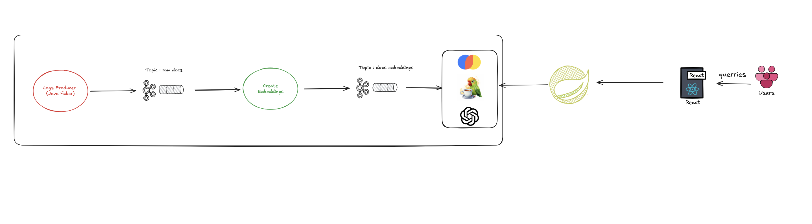

# Real-Time Attack Log Analysis with Kafka & ChromaDB



This project demonstrates a real-time pipeline for generating, processing, and querying cybersecurity attack logs using Apache Kafka and ChromaDB with OpenAI and langchain4j.

## Components

1. **Log Producer**

   - Generates synthetic attack logs (SQLi, XSS, DDoS, etc.) using JavaFaker.
   - Publishes JSON-formatted logs to Kafka topic `attack-logs`.
   - Features batch processing, compression (LZ4), and throughput monitoring.

2. **Log Consumer**

   - Consumes logs from Kafka and stores them in ChromaDB with embeddings.
   - Provides interactive terminal for natural language queries:

3. **ChromaDB Integration**

- Uses OpenAI's `text-embedding-ada-002` for text embeddings.
- Enables semantic search through stored logs.
- Example implementations with metadata filtering included.

## Technical Stack

- **Streaming**: Apache Kafka
- **Vector DB**: ChromaDB
- **Embeddings**: OpenAI API
- **NLP**: LangChain4J

## Setup

1. Start Kafka and ChromaDB locally.
2. Set OpenAI API key in `Chroma.java`.
3. Run producer and consumer:

```bash
mvn exec:java -Dexec.mainClass="imt.ibd.LogProducer"
mvn exec:java -Dexec.mainClass="imt.ibd.LogConsumer"
```

## Features

- Fake log generation with configurable parameters.
- Throughput-optimized Kafka producer.
- Semantic search using vector embeddings.
- Metadata filtering examples for ChromaDB.
